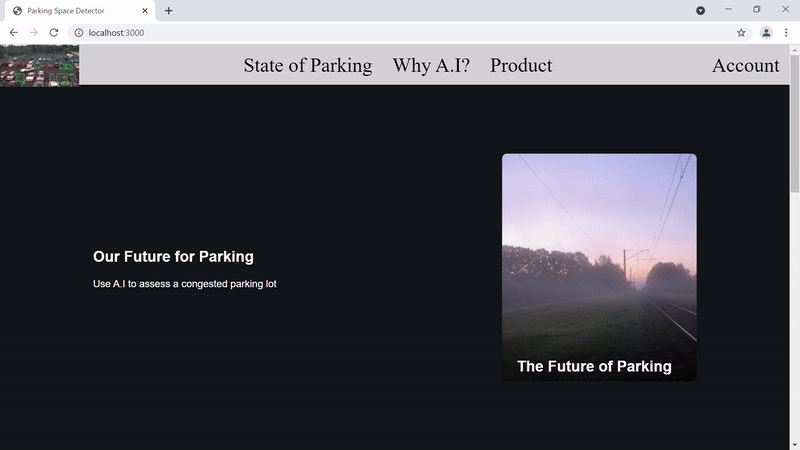
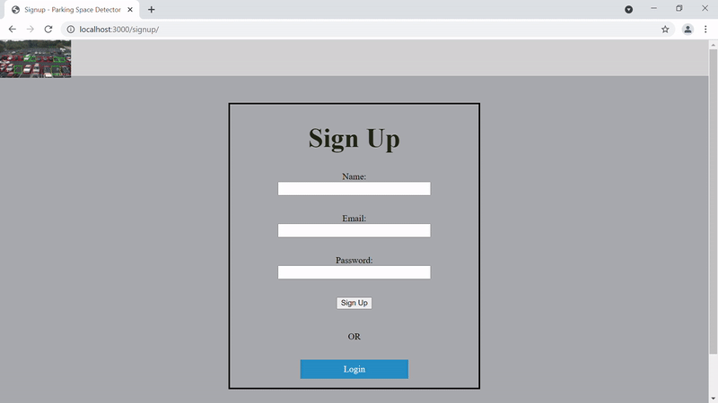

# Website for Parking Space Detector

Homepage

Signup & Account pages

Within this project, we attempt to create a website to demonstrate a [machine
learning model](https://github.com/ss-raicangu/parking-detection-ml.git) that is
trained to detect vacant parking space. It also serves as practice for our web
development skills and a project for our work portfolio.

## Installation Stack

Our web server is run locally and this website has not been published under an
internet domain. We are using the MERN stack, containing the following
technologies.

1. [MongoDB Community Server](https://www.mongodb.com/),
2. [Express.js 4.x](https://expressjs.com/),
3. [React.js 17.x](https://reactjs.org/),
4. [Node.js 15.x](https://nodejs.org/en/).

Only Node.js and MongoDB need to be downloaded from the web browser. Express.js
can be installed through `npm` and React.js has been included as top-level HTML
scripts.

## Planning

This project has been planned using a combination of the Kanban and SCRUM
methodologies. All planning has been undertaken in on-demand Skype meetings and
documented in our [Trello
board](https://trello.com/b/uSqxAB5O/parking-detection-ml).

## File Structure

This particular file and directory structure has been inspired by the no-view
structure of the
[`express-generator`](https://www.npmjs.com/package/express-generator) package
in the `npm` repositories.

Currently, our website's main content resides in the `public/` directory within
the following files.

1. `public/index.html`,
2. `public/scripts/index.jsx`,
3. `public/stylesheets/index.css`.

## Inspirations

The website's design has been inspired by [tesla.com](https://www.tesla.com/)
and [comma.ai](https://comma.ai/).
